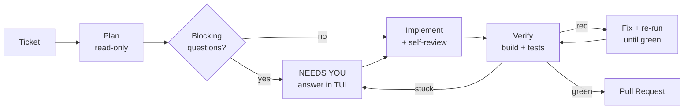

# Magneton

> **A CLI to run your Android development loop, instead of prompting Claude Code by hand.**

Install with one command (macOS/Linux), then run `magneton init`:

```bash
curl -fsSL https://raw.githubusercontent.com/andresuarezz26/magneton/main/install.sh | bash
```

You already use Claude Code to work tickets by hand: plan the change, make it, run the build and tests, open the PR, repeat for the next ticket. Magneton runs that loop for you. Each ticket goes through plan → implement → verify in its own git worktree, in parallel, and only becomes a pull request after the agent has actually seen the build and tests pass. If verification fails, it fixes and re-runs until green, or hands the ticket back to you. You stay the reviewer, not the operator.

**Requires:** [Claude Code](https://claude.ai/download) (authenticated), `git` + `gh`, [Android Studio](https://developer.android.com/studio).

## The pipeline



| Stage | What it does |
|-------|--------------|
| **Plan** | Reads the codebase read-only, writes a focused plan, flags blocking questions, decides if the ticket needs an emulator (Compose/Espresso) or unit tests only |
| **Implement** | Makes the minimal change the plan describes, then adversarially reviews its own diff |
| **Verify** | Discovers how *your* project builds, runs the real build + tests (boots the emulator if needed), certifies green only after seeing them pass |

When an agent gets stuck (an ambiguous ticket, a compile error it can't fix), the ticket flips to **NEEDS YOU**. Answer in the TUI, resume the Claude session, or open the worktree in Android Studio.

## Why Android-native matters

General ticket→PR agents (Devin, OpenHands, Copilot Workspace) don't know what verifying an Android change means. Magneton does:

- **Emulator as a shared resource.** A SQLite-backed semaphore lets parallel agents take turns on one AVD; no two agents fight over a device.
- **Instrumented vs. unit test routing.** Decided at plan time, enforced at verify time.
- **Gradle-aware verification.** The agent discovers your project's own build setup, including company build scripts.
- **Worktree → Android Studio handoff.** One keystroke opens any agent's worktree in the IDE.
- **Screenshot tickets.** Drag images into the terminal; the agent sees them while planning.

## Why I built it

My company measures productivity by PRs merged. I ran Claude Code agents in parallel with git worktrees to keep up, and ended up supervising every one of them: terminals, branches, plan mode, the emulator, PR descriptions. Magneton automates that toil. My PR count roughly doubled; now I mostly just review.

## Usage

```bash
magneton                          # TUI dashboard: queue tickets, watch live status
magneton init                     # configure repo, build commands, optional Jira

magneton run PROJ-123             # one Jira ticket → PR
magneton run PROJ-123 PROJ-124    # two Jira tickets in parallel
magneton run a.md b.md c.md       # local markdown tickets, in parallel

magneton run PROJ-123 --dry-run   # skip push + PR (try this first)
magneton run PROJ-123 --resume    # re-verify a worktree you fixed by hand, then PR
magneton run PROJ-123 --ship      # skip verification: commit + push + PR from your manual fix
magneton run PROJ-124 --base ai/proj-123  # stack on another ticket's branch; PR targets it

magneton doctor                   # check Jira, git, claude, gh connectivity
magneton logs PROJ-123            # print the session log for a ticket
magneton status                   # table of all sessions
magneton start                    # start the background daemon
magneton stop                     # stop the daemon
```

In the TUI, add tickets three ways: **paste** the ticket text (from Jira, Linear, anywhere; drag screenshots to attach them), enter a **Jira key**, or point at a **.md file**. Queue several, press enter, watch the dashboard.

Config lives at `~/.agent/config.toml`: repo path, per-stage models, branch naming, [Jira credentials](docs/jira.md) (optional; token stored in your OS keychain).

## Cost

Runs on your existing Claude Code subscription or API key. No separate account, no markup. Each ticket is a full working session's worth of tokens; five parallel tickets ≈ five concurrent sessions. Start with one.

## Caveats

- **You still review.** Autonomous loops make autonomous mistakes; the PR gate is where your judgment goes.
- Never auto-merges. Every ticket stops at review.
- Well-defined tickets sail through; vague ones come back as questions.

## Uninstall

```bash
magneton stop 2>/dev/null   # stop the daemon if it's running
rm ~/.local/bin/magneton    # remove the binary
rm -rf ~/.agent             # remove config, state, logs, and default worktrees
```

Magneton also creates a `<your-repo>-worktrees/` folder next to your Android repo. Delete it if you don't want the leftover worktrees. If you added a Jira token, it lives in your OS keychain under `magneton`. If you built from source, also `rm -rf ~/.magneton`.

## License

MIT. See [LICENSE](LICENSE).
