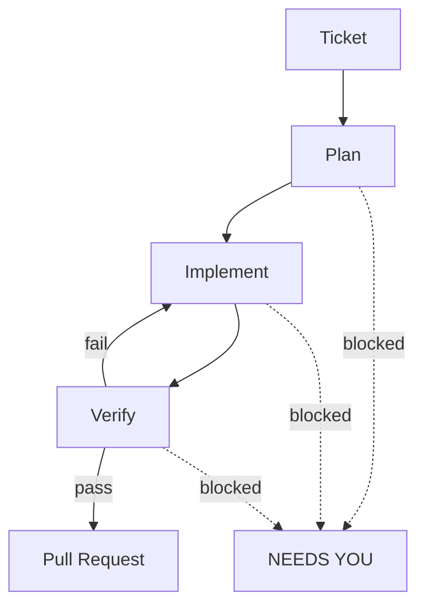

# Magneton

> **A CLI to run your Android development loops, instead of prompting Claude Code by hand.**

You already use Claude Code to work tickets by hand: plan the change, make it, run the build and tests, open the PR, repeat for the next ticket. Magneton runs that loop for you. Each ticket goes through plan → implement → verify in its own git worktree, and only becomes a pull request after the agent has actually seen the build and tests pass. If verification fails, it fixes and re-runs until green, or hands the ticket back to you. You stay the reviewer, not the operator.

Run many loops in parallel, follow all of them from one control panel, and get pinged when an agent is blocked.

## Install

One command on macOS or Linux:

```bash
curl -fsSL https://raw.githubusercontent.com/andresuarezz26/magneton/main/install.sh | bash
```

Then run `magneton init` to configure your repo.

**Requires:** [Claude Code](https://claude.ai/download) (authenticated), `git` + `gh`, [Android Studio](https://developer.android.com/studio).

## The loop



| Stage | What it does |
|-------|--------------|
| **Plan** | Explores the codebase read-only with Claude Code's own planning tooling and writes a free-form markdown plan - magneton doesn't constrain how it plans, it only extracts what the orchestrator needs: blocking questions, and whether the ticket needs an emulator (Compose/Espresso) or unit tests only |
| **Implement** | Makes the change the plan describes, then adversarially reviews its own diff |
| **Verify** | Discovers how *your* project builds, runs the real build + tests (boots the emulator if needed), certifies green only after seeing them pass |

Want a checkpoint before any code is written? Turn on the **plan-review gate** (per ticket when queueing, `review_plans` in config, or `--review-plan`): the run pauses after planning so you can read the plan in the TUI's full-screen markdown viewer, approve it, or send feedback for a re-plan.

Every plan is also archived to `~/.magneton/plans/<ticket>.md` - open it any time with **View Plan** from a ticket's dashboard menu. Plans, reports, and review verdicts live in magneton's home, never in your repo: the `.agent/` scratch directory agents use inside the worktree is git-excluded and scrubbed before every commit, so magneton artifacts can't leak into your PRs.

When an agent gets stuck (an ambiguous ticket, a compile error it can't fix), the ticket flips to **NEEDS YOU**. Answer in the TUI, resume the Claude session, or open the worktree in Android Studio.

## Why Android-native matters

General ticket→PR agents (Devin, OpenHands, Copilot Workspace) don't know what verifying an Android change means. Magneton does:

- **Emulator as a shared resource.** The SDK and AVD are auto-detected - zero config - and a SQLite-backed semaphore lets parallel agents take turns on one AVD; no two agents fight over a device.
- **Instrumented vs. unit test routing.** Decided at plan time, enforced at verify time.
- **Gradle-aware verification.** The agent discovers your project's own build setup, including company build scripts.
- **Worktree → Android Studio handoff.** One keystroke opens any agent's worktree in the IDE.
- **Screenshot tickets.** Drag images into the terminal; the agent sees them while planning.

## Why I built it

My company measures productivity by PRs merged. I ran Claude Code agents in parallel with git worktrees to keep up, and ended up supervising every one of them: terminals, branches, plan mode, the emulator, PR descriptions. Magneton automates that toil. My PR count roughly doubled; now I mostly just review.

## Usage

```bash
magneton                          # TUI dashboard: queue tickets, watch live status
magneton init                     # configure repo, branch, and per-stage models

magneton run PROJ-123             # one ticket → PR
magneton run PROJ-123 PROJ-124    # two tickets in parallel
magneton run a.md b.md c.md       # local markdown tickets, in parallel

magneton run PROJ-123 --dry-run   # skip push + PR (try this first)
magneton run PROJ-123 --review-plan       # pause after planning; approve or give feedback in the TUI
magneton run PROJ-123 --branch feat/login # exact PR branch name (default: the pattern in config)
magneton run PROJ-123 --resume    # re-verify a worktree you fixed by hand, then PR
magneton run PROJ-123 --ship      # skip verification: commit + push + PR from your manual fix
magneton run PROJ-124 --base ai/proj-123  # stack on another ticket's branch; PR targets it

magneton doctor                   # check git, claude, gh connectivity
magneton logs PROJ-123            # print the session log for a ticket
magneton status                   # table of all sessions
magneton start                    # start the background daemon
magneton stop                     # stop the daemon
```

In the TUI, **write or paste** the ticket, confirm its id and branch name, and press enter. Queue several and watch the dashboard.

Config lives at `~/.magneton/config.toml`: repo path, per-stage models, branch naming, and the plan-review default.

## Cost

Runs on your existing Claude Code subscription or API key. No separate account, no markup. Each ticket is a full working session's worth of tokens; five parallel tickets ≈ five concurrent sessions. Start with one.

## Caveats

- **You still review.** Autonomous loops make autonomous mistakes; the PR gate is where your judgment goes.
- Never auto-merges. Every ticket stops at review.
- Well-defined tickets sail through; vague ones come back as questions.

## Uninstall

```bash
magneton stop 2>/dev/null   # stop the daemon if it's running
rm ~/.local/bin/magneton    # remove the binary
rm -rf ~/.magneton          # remove config, state, logs, and worktrees
```

All of magneton's data - config, state, logs, and per-ticket worktrees - lives under `~/.magneton`, so the commands above remove everything.

## License

MIT. See [LICENSE](LICENSE).
